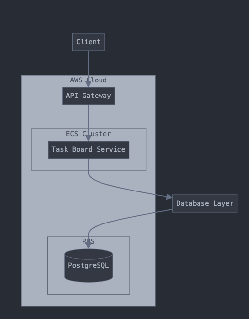
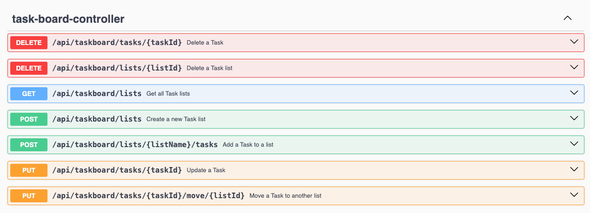

## TaskBoard REST Service

This is a Spring Boot application for a task board REST service. It allows users to manage lists of tasks with the
following features:

- View all created lists and tasks
- Create an empty list with a name property
- Add tasks to a list with name and description
- Update tasks within a list
- Delete tasks
- Delete lists with all its tasks
- Move tasks between lists

### Architecture Diagram



### Technologies Used

- Java 21
- Spring Boot 3.2.5
- Spring Data JDBC (for persistence)
- PostgreSQL (relational database)
- Liquibase (for database schema management)
- Swagger (for API documentation)
- Gradle (build tool)
- Testcontainers (for Dockerized integration tests)
- Docker (for containerization)
- AWS (for deployment)

### Prerequisites

- Java 21
- Gradle 8.x
- Docker and Docker Compose
- PostgreSQL (local or via Docker)
- AWS CLI (for deployment)

### Setup and Running Locally

#### 1. Clone the Repository

```
git clone git@github.com:SoumalyaDe/taskboard.git
cd taskboard
```

#### 2. Start PostgreSQL

Run PostgreSQL using Docker:

`docker run -d --name postgres -p 5432:5432 -e POSTGRES_DB=taskboard -e POSTGRES_USER=postgres -e POSTGRES_PASSWORD=postgres postgres:16-alpine`

#### 3. Build the Application

`./gradlew clean build`

#### 4. Run the Application

`./gradlew bootRun`
Alternatively, the spring boot application can be started from the `TaskBoardApplication` class in IDE.

The application will be available at http://localhost:8080.

#### 5. Run Tests
- **Unit Test**
  - Use this to run the unit tests (excluding the integration tests): `./gradlew test`.
  - Alternatively, unit tests can be run from the respective test classes from the IDE as well.
- **Integration Test**
  - The integration tests use Testcontainers to spin up a PostgreSQL container automatically.
  - Use this command to run integration tests: `./gradlew integrationTest`.

#### 6. Access Swagger UI

Swagger UI is available at http://localhost:8080/swagger-ui.html for testing the API endpoints interactively.
Username: admin
Password: password

### API Endpoints



### Database Schema Management

The application uses Liquibase to manage the database schema. The schema is defined in
```src/main/resources/db/db.changelog-master.yaml.```
Liquibase runs automatically on application startup to apply migrations.

### Dockerize the Application

1. Build the Docker image:

./gradlew bootBuildImage --imageName=worldline/taskboard:0.0.1-SNAPSHOT

2. Run the Docker container:

docker run -d -p 8080:8080 --link postgres:postgres -e SPRING_DATASOURCE_URL=jdbc:postgresql://postgres:5432/taskboard
worldline/taskboard:0.0.1-SNAPSHOT


### Continuous Integration

This project uses GitHub Actions for continuous integration (CI) to ensure code quality and reliability. 
The CI pipeline runs automatically on every push to the main branch and on pull requests. The workflow is defined in `.github/workflows/ci.yml`


### Developer Onboarding

- The project follows a layered architecture (controller, service, repository) for separation of concerns.
- Spring Data JDBC is used for persistence, providing a lightweight alternative to JPA.
- Liquibase manages the database schema, ensuring consistent migrations across environments.
- Swagger UI provides interactive API documentation at /swagger-ui.html.
- Integration tests are provided using Testcontainers for realistic database testing.
- The application can be run locally with Docker or directly via Gradle.
- Deployment to AWS is documented for production use.
